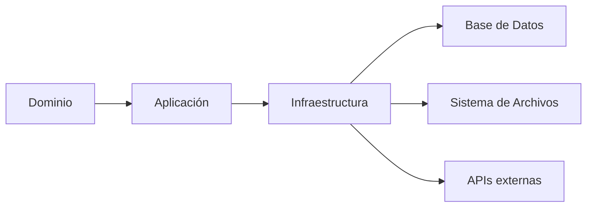

# Dependencias

Las dependencias son paquetes de código que proporcionan funcionalidades que no queremos implementar desde cero. En este proyecto, estamos utilizando las siguientes dependencias:

- @elysiajs/swagger: Es una biblioteca para generar documentación de API utilizando el estándar OpenAPI. Nos permite definir nuestras rutas de API y sus parámetros, y luego genera una interfaz de usuario interactiva donde podemos probar nuestras rutas de API.
- elysia: Es un marco de trabajo para construir aplicaciones web en Node.js. Proporciona una estructura para organizar nuestro código y facilita la creación de rutas de API, controladores, servicios, etc.
- node-dependency-injection: Es una biblioteca para implementar la inyección de dependencias en Node.js. Esto nos permite desacoplar nuestro código y hacerlo más modular y fácil de probar.
- qrcode-terminal: Es una biblioteca para generar códigos QR en la terminal. Podemos usar esto para generar códigos QR a partir de texto en la terminal.
- uuid: Es una biblioteca para generar identificadores únicos. Esto es útil para generar identificadores únicos para nuestros objetos de datos.

## Para crear un proyecto utilizando npx y bunx, puedes seguir los siguientes pasos

Abre tu terminal y navega hasta el directorio donde deseas crear tu proyecto.
Ejecuta el siguiente comando para crear un nuevo proyecto utilizando npx y bunx:

```bash
npx osedhelu <nombre_del_directorio>
```

o

```bash
bunx osedhelu <nombre_del_directorio>
```

Asegúrate de reemplazar <nombre_del_directorio> con el nombre que deseas darle a tu proyecto.

## To install dependencies

```bash
bun install
```

To run dev:

```bash
bun start:dev
```

## Arquitectura Hexagonal

La arquitectura hexagonal, también conocida como arquitectura de puertos y adaptadores, es un patrón de diseño que nos permite separar la lógica de negocio de nuestra aplicación de su infraestructura. Esto nos permite cambiar la infraestructura (por ejemplo, cambiar de una base de datos a otra) sin afectar a la lógica de negocio.

En la arquitectura hexagonal, nuestra aplicación se divide en tres capas: dominio, aplicación y infraestructura.

- Dominio: Esta es la capa donde reside toda la lógica de negocio de nuestra aplicación. Define las entidades, los casos de uso y las interfaces que las otras capas deben implementar.
- Aplicación: Esta capa implementa las interfaces definidas en el dominio. Utiliza los servicios de la capa de infraestructura para interactuar con la base de datos, el sistema de archivos, etc.
- Infraestructura: Esta capa implementa los adaptadores que permiten a la capa de aplicación interactuar con el mundo exterior (por ejemplo, la base de datos, el sistema de archivos, etc.).
Cada vez que creamos un nuevo directorio en la carpeta app, se genera automáticamente la estructura de la arquitectura hexagonal para ese directorio. Esto nos permite mantener nuestro código organizado y modular.

Diagrama de la Arquitectura Hexagonal



En este diagrama, las flechas representan las dependencias entre las diferentes capas de nuestra aplicación. Por ejemplo, la capa de aplicación depende de la capa de dominio (porque implementa las interfaces definidas en el dominio), y la capa de infraestructura depende de la capa de aplicación (porque utiliza los servicios de la capa de aplicación para interactuar con el mundo exterior).
